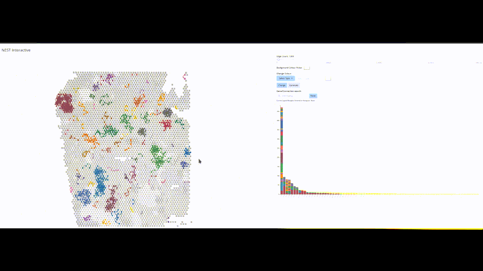
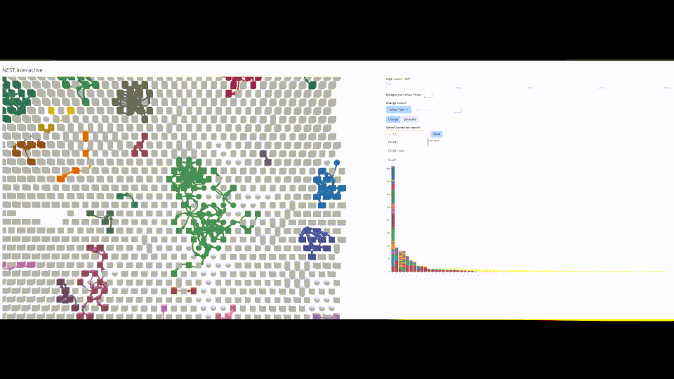

#  CellNEST-Interactive

CellNEST-Interactive is an interacive exploration tool for
[NEST](https://github.com/schwartzlab-methods/CellNEST) output.

## Zoom and pan exploration


## Ligand-Receptor pair filtering


## Vertex (spot or cell) color changing


## Communication color changing


## Increase range of reliable signals


## Python package dependencies:
  ```
  django
  numpy
  scipy
  matplotlib
  pandas
  altair
  django-cors-headers
  ```
## Required preprocessed metadata and output files from the CellNEST model
We need the following five files:
1. cell_barcode_*.csv file generated by CellNEST in the data preprocessing step. 
2. coordinates_*.csv file generated by CellNEST in the data preprocessing step.
3. *_self_loop_record.gz file generated by CellNEST in the data preprocessing step.
4. Optional *_annotation.csv file, if available.
5. CellNEST_*_top20percent.csv file generated by CellNEST in the data postprocessing step.
   
Keep these five files under the same directory and use that directory path (e.g., server/data/files/ ) while running the interactive version as explained below.

## Instructions to run CellNEST Interactive:
Navigate into the pulled nest_interactive directory. Please run the following command with two arguments:
1. Desired port to run the frontend, e.g., 8080
2. Path to the directory having CellNEST output and required metadata files, e.g., barcode, coordinates, etc.

A sample command is provided below: 
````
bash nest_interactive 8080 server/data/files/ 
````

However, if you are interested to run the frontend and backend separately, you can follow the instructions below. 

#### Frontend:

1. If VSCode is installed, adding the "Live Server" extension from Ritwick Dey makes spinning up a server easy. Access the server hosted at http://127.0.0.1:5500/HTML%20file/NEST-vis.html
2. Otherwise
   - Run `python -m http.server 8080` from the root directory
   - Open http://localhost and navigate to "HTML file" then "NEST-vis.html"
   - Server should be hosted at http://localhost/HTML%20file/NEST-vis.html

#### Backend:

- Navigate into the server directory (`cd server`)
- Install pipenv
- Run `pipenv shell` then `pipenv install`

  - The required packages are:
  ```
  django
  numpy
  scipy
  matplotlib
  pandas
  altair
  django-cors-headers
  ```
- Run `python ./manage.py setdata DIRECTORY_NAME
- Run `python ./manage.py runserver`
